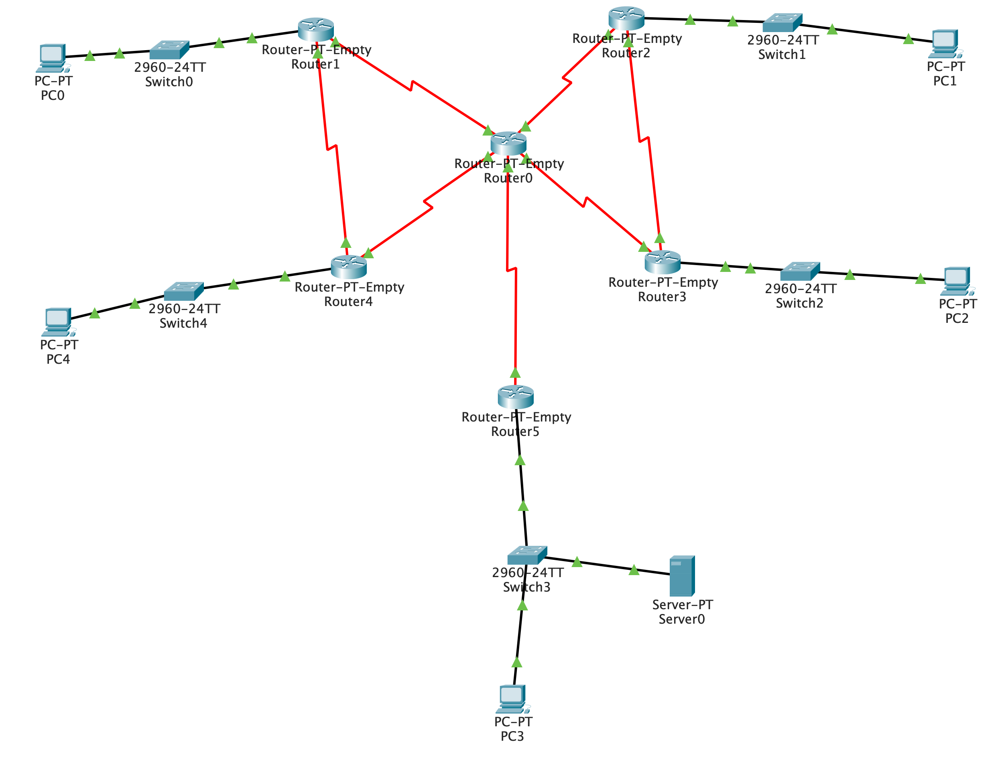
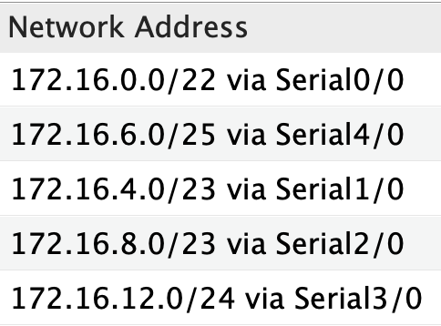
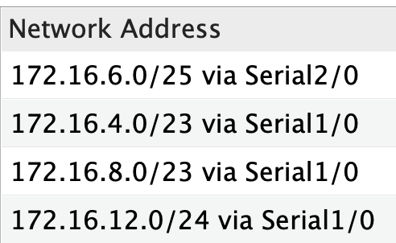
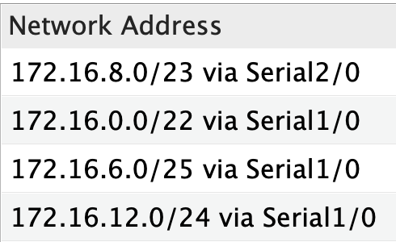
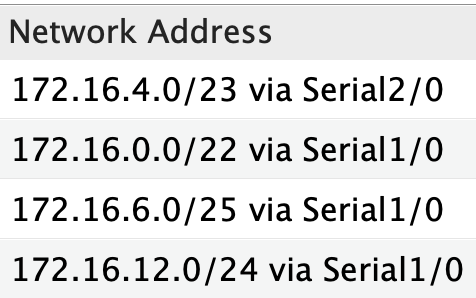
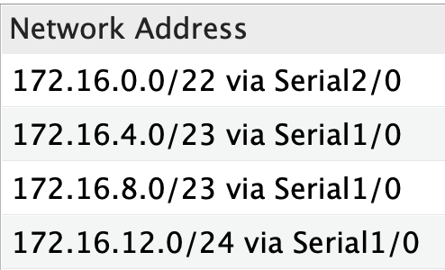
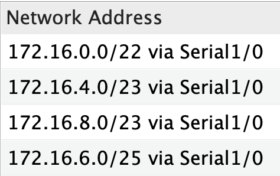
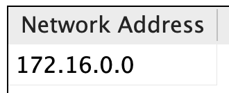

# COMP 445 Lab Assignment 3

## Network Layer

Due Date: April 11th, 2021

Version number: 4

| Name               | ID       |
| ------------------ | -------- |
| Gordon Pham-Nguyen | 40018402 |

### 1. Given the IP address 172.16.0.0/16, satisfy the number of hosts for each LAN using VLSM

172.16.0.0/16, implies there are 32 - 16 = 16 bits to address hosts.

| Number | LAN            | Required hosts | Nearest block size    | Host addresses |
| ------ | -------------- | -------------- | --------------------- | -------------- |
| 1      | S0             | 1000           | 210 = 1024 | 1022           |
| 2      | S4             | 750            | 210 = 1024 | 1022           |
| 3      | S1             | 332            | 29 = 512   | 510            |
| 4      | S2             | 175            | 28 = 256   | 254            |
| 5      | S3             | 64             | 27 = 128   | 126            |
| 6      | R0-R1-R2-R3-R4 | 5              | 23 = 8     | 6              |

Table 1

#### First iteration

For 1000 hosts, we leave 10 bits for the host number (210 - 2 = 1022) and borrow 16 - 10 = 6 bits from the 16 bit host.

There will be 26 = 64 subnets. Thus, the first subnet mask is /22 (16 + 6), or 255.255.252.0.

To get the multiplier, we do 256 - 252 = 4.

| Number | Subnet Address | Host Range                    | Broadcast Address |
| ------ | -------------- | ----------------------------- | ----------------- |
| 1      | 172.16.0.0     | 172.16.0.1 - 172.16.3.254     | 172.16.3.255      |
| 2      | 172.16.4.0     | 172.16.4.1 - 172.16.7.254     | 172.16.7.255      |
| 3      | 172.16.8.0     | 172.16.8.1 - 172.16.11.254    | 172.16.11.255     |
| 4      | 172.16.12.0    | 172.16.12.1 - 172.16.15.254   | 172.16.15.255     |
| 5      | 172.16.16.0    | 172.16.16.1 - 172.16.19.254   | 172.16.19.255     |
| 6      | 172.16.20.0    | 172.16.20.1 - 172.16.23.254   | 172.16.23.255     |
| 7      | 172.16.24.0    | 172.16.24.1 - 172.16.27.254   | 172.16.27.255     |
| 8      | 172.16.28.0    | 172.16.28.1 - 172.16.31.254   | 172.16.31.255     |
| 9      | 172.16.32.0    | 172.16.32.1 - 172.16.35.254   | 172.16.35.255     |
| 10     | 172.16.36.0    | 172.16.36.1 - 172.16.39.254   | 172.16.39.255     |
| 11     | 172.16.40.0    | 172.16.40.1 - 172.16.43.254   | 172.16.43.255     |
| 12     | 172.16.44.0    | 172.16.44.1 - 172.16.47.254   | 172.16.47.255     |
| 13     | 172.16.48.0    | 172.16.48.1 - 172.16.51.254   | 172.16.51.255     |
| 14     | 172.16.52.0    | 172.16.52.1 - 172.16.55.254   | 172.16.55.255     |
| 15     | 172.16.56.0    | 172.16.56.1 - 172.16.59.254   | 172.16.59.255     |
| 16     | 172.16.60.0    | 172.16.60.1 - 172.16.63.254   | 172.16.63.255     |
| 17     | 172.16.64.0    | 172.16.64.1 - 172.16.67.254   | 172.16.67.255     |
| 18     | 172.16.68.0    | 172.16.68.1 - 172.16.71.254   | 172.16.71.255     |
| 19     | 172.16.72.0    | 172.16.72.1 - 172.16.75.254   | 172.16.75.255     |
| 20     | 172.16.76.0    | 172.16.76.1 - 172.16.79.254   | 172.16.79.255     |
| 21     | 172.16.80.0    | 172.16.80.1 - 172.16.83.254   | 172.16.83.255     |
| 22     | 172.16.84.0    | 172.16.84.1 - 172.16.87.254   | 172.16.87.255     |
| 23     | 172.16.88.0    | 172.16.88.1 - 172.16.91.254   | 172.16.91.255     |
| 24     | 172.16.92.0    | 172.16.92.1 - 172.16.95.254   | 172.16.95.255     |
| 25     | 172.16.96.0    | 172.16.96.1 - 172.16.99.254   | 172.16.99.255     |
| 26     | 172.16.100.0   | 172.16.100.1 - 172.16.103.254 | 172.16.103.255    |
| 27     | 172.16.104.0   | 172.16.104.1 - 172.16.107.254 | 172.16.107.255    |
| 28     | 172.16.108.0   | 172.16.108.1 - 172.16.111.254 | 172.16.111.255    |
| 29     | 172.16.112.0   | 172.16.112.1 - 172.16.115.254 | 172.16.115.255    |
| 30     | 172.16.116.0   | 172.16.116.1 - 172.16.119.254 | 172.16.119.255    |
| 31     | 172.16.120.0   | 172.16.120.1 - 172.16.123.254 | 172.16.123.255    |
| 32     | 172.16.124.0   | 172.16.124.1 - 172.16.127.254 | 172.16.127.255    |
| 33     | 172.16.128.0   | 172.16.128.1 - 172.16.131.254 | 172.16.131.255    |
| 34     | 172.16.132.0   | 172.16.132.1 - 172.16.135.254 | 172.16.135.255    |
| 35     | 172.16.136.0   | 172.16.136.1 - 172.16.139.254 | 172.16.139.255    |
| 36     | 172.16.140.0   | 172.16.140.1 - 172.16.143.254 | 172.16.143.255    |
| 37     | 172.16.144.0   | 172.16.144.1 - 172.16.147.254 | 172.16.147.255    |
| 38     | 172.16.148.0   | 172.16.148.1 - 172.16.151.254 | 172.16.151.255    |
| 39     | 172.16.152.0   | 172.16.152.1 - 172.16.155.254 | 172.16.155.255    |
| 40     | 172.16.156.0   | 172.16.156.1 - 172.16.159.254 | 172.16.159.255    |
| 41     | 172.16.160.0   | 172.16.160.1 - 172.16.163.254 | 172.16.163.255    |
| 42     | 172.16.164.0   | 172.16.164.1 - 172.16.167.254 | 172.16.167.255    |
| 43     | 172.16.168.0   | 172.16.168.1 - 172.16.171.254 | 172.16.171.255    |
| 44     | 172.16.172.0   | 172.16.172.1 - 172.16.175.254 | 172.16.175.255    |
| 45     | 172.16.176.0   | 172.16.176.1 - 172.16.179.254 | 172.16.179.255    |
| 46     | 172.16.180.0   | 172.16.180.1 - 172.16.183.254 | 172.16.183.255    |
| 47     | 172.16.184.0   | 172.16.184.1 - 172.16.187.254 | 172.16.187.255    |
| 48     | 172.16.188.0   | 172.16.188.1 - 172.16.191.254 | 172.16.191.255    |
| 49     | 172.16.192.0   | 172.16.192.1 - 172.16.195.254 | 172.16.195.255    |
| 50     | 172.16.196.0   | 172.16.196.1 - 172.16.199.254 | 172.16.199.255    |
| 51     | 172.16.200.0   | 172.16.200.1 - 172.16.203.254 | 172.16.203.255    |
| 52     | 172.16.204.0   | 172.16.204.1 - 172.16.207.254 | 172.16.207.255    |
| 53     | 172.16.208.0   | 172.16.208.1 - 172.16.211.254 | 172.16.211.255    |
| 54     | 172.16.212.0   | 172.16.212.1 - 172.16.215.254 | 172.16.215.255    |
| 55     | 172.16.216.0   | 172.16.216.1 - 172.16.219.254 | 172.16.219.255    |
| 56     | 172.16.220.0   | 172.16.220.1 - 172.16.223.254 | 172.16.223.255    |
| 57     | 172.16.224.0   | 172.16.224.1 - 172.16.227.254 | 172.16.227.255    |
| 58     | 172.16.228.0   | 172.16.228.1 - 172.16.231.254 | 172.16.231.255    |
| 59     | 172.16.232.0   | 172.16.232.1 - 172.16.235.254 | 172.16.235.255    |
| 60     | 172.16.236.0   | 172.16.236.1 - 172.16.239.254 | 172.16.239.255    |
| 61     | 172.16.240.0   | 172.16.240.1 - 172.16.243.254 | 172.16.243.255    |
| 62     | 172.16.244.0   | 172.16.244.1 - 172.16.247.254 | 172.16.247.255    |
| 63     | 172.16.248.0   | 172.16.248.1 - 172.16.251.254 | 172.16.251.255    |
| 64     | 172.16.252.0   | 172.16.252.1 - 172.16.255.254 | 172.16.255.255    |

Table 2

We reserve 172.16.0.0/22 for LAN S0.

#### Second iteration

To satisfy 750 hosts, we use the next subnet 172.16.4.0/22 from the above Table 2. 32 - 22 = 10 host bits which we use for the host number. Borrow 1 bit for 21 = 2 subnets.

The next subnet mask is /23 (22 + 1), or 255.255.254.0.

To get the multiplier, we do 256 - 254 = 2.

| Number | Subnet Address | Host Range                | Broadcast Address |
| ------ | -------------- | ------------------------- | ----------------- |
| 1      | 172.16.4.0     | 172.16.4.1 - 172.16.5.254 | 172.16.5.255      |
| 2      | 172.16.6.0     | 172.16.6.1 - 172.16.7.254 | 172.16.7.255      |

Table 3

We reserve 172.16.4.0/23 for LAN S4.

#### Third iteration

Continuing with 332 required hosts, we use the subnet 172.16.8.0/22 from Table 2. 32 - 22 = 10 host bits.

Use 9 for the host number and borrow 10 - 9 = 1 for the subnet. 21 = 2 subnets.

The next subnet mask is /23 (22 + 1), or 255.255.254.0.

Multiplier is 256 - 254 = 2.

| Number | Subnet Address | Host Range                  | Broadcast Address |
| ------ | -------------- | --------------------------- | ----------------- |
| 1      | 172.16.8.0     | 172.16.8.1 - 172.16.9.254   | 172.16.9.255      |
| 2      | 172.16.10.0    | 172.16.10.1 - 172.16.11.254 | 172.16.11.255     |

Table 4

We reserve 172.16.8.0/23 for LAN S1.

#### Fourth iteration

S2 requires 175 hosts. 8 bits are needed for the host number. We take 172.16.12.0/22 from Table 2 to subnet.

32 - 22 = 10 bits. 10 - 8 = 2 borrowed bits. 22 = 4 subnets.

The next subnet mask is /24 (22 + 2), or 255.255.255.0.

Multiplier is 256 - 255 = 1.

| Number | Subnet Address | Host Range                  | Broadcast Address |
| ------ | -------------- | --------------------------- | ----------------- |
| 1      | 172.16.12.0    | 172.16.12.1 - 172.16.12.254 | 172.16.12.255     |
| 2      | 172.16.13.0    | 172.16.13.1 - 172.16.13.254 | 172.16.13.255     |
| 3      | 172.16.14.0    | 172.16.14.1 - 172.16.14.254 | 172.16.14.255     |
| 4      | 172.16.15.0    | 172.16.15.1 - 172.16.15.254 | 172.16.15.255     |

Table 5

We reserve 172.16.12.0/24 for LAN S2.

#### Fifth iteration

LAN S3 needs 64 hosts. Use 7 bits for host number. We take 172.16.6.0/23 from Table 3 to subnet. 32 - 23 = 9. 9 - 7 = 2 borrowed bits.

22 = 4 subnets.

Subnet mask is /25 (23 + 2), or 255.255.255.128.

Multiplier is 256 - 128 = 128.

| Number | Subnet Address | Host Range                  | Broadcast Address |
| ------ | -------------- | --------------------------- | ----------------- |
| 1      | 172.16.6.0     | 172.16.6.1 - 172.16.6.126   | 172.16.6.127      |
| 2      | 172.16.6.128   | 172.16.6.129 - 172.16.6.254 | 172.16.6.255      |
| 3      | 172.16.7.0     | 172.16.7.1 - 172.16.7.126   | 172.16.7.127      |
| 4      | 172.16.7.128   | 172.16.7.129 - 172.16.7.254 | 172.16.7.255      |

Table 6

We reserve 172.16.6.0/25 for LAN S3.

#### Sixth iteration

Finally, for R0-R1-R2-R3-R4, we need 5 hosts. So we use 3 bits for host numbers. We take 172.16.6.128/25 from Table 6 to subnet.

32 - 25 = 7. 7 - 3 = 4 borrowed bits. 24 = 16 subnets.

Subnet mask is /29 (25 + 4), or 255.255.255.248. Multiplier is 256 - 248 = 8.

| Number | Subnet Address | Host Range                  | Broadcast Address |
| ------ | -------------- | --------------------------- | ----------------- |
| 1      | 172.16.6.128   | 172.16.6.129 - 172.16.6.134 | 172.16.6.135      |
| 2      | 172.16.6.136   | 172.16.6.137 - 172.16.6.142 | 172.16.6.143      |
| 3      | 172.16.6.144   | 172.16.6.145 - 172.16.6.150 | 172.16.6.151      |
| 4      | 172.16.6.152   | 172.16.6.153 - 172.16.6.158 | 172.16.6.159      |
| 5      | 172.16.6.160   | 172.16.6.161 - 172.16.6.166 | 172.16.6.167      |
| 6      | 172.16.6.168   | 172.16.6.169 - 172.16.6.174 | 172.16.6.175      |
| 7      | 172.16.6.176   | 172.16.6.177 - 172.16.6.182 | 172.16.6.183      |
| 8      | 172.16.6.184   | 172.16.6.185 - 172.16.6.190 | 172.16.6.191      |
| 9      | 172.16.6.192   | 172.16.6.193 - 172.16.6.198 | 172.16.6.199      |
| 10     | 172.16.6.200   | 172.16.6.201 - 172.16.6.206 | 172.16.6.207      |
| 11     | 172.16.6.208   | 172.16.6.209 - 172.16.6.214 | 172.16.6.215      |
| 12     | 172.16.6.216   | 172.16.6.217 - 172.16.6.222 | 172.16.6.223      |
| 13     | 172.16.6.224   | 172.16.6.225 - 172.16.6.230 | 172.16.6.231      |
| 14     | 172.16.6.232   | 172.16.6.233 - 172.16.6.238 | 172.16.6.239      |
| 15     | 172.16.6.240   | 172.16.6.241 - 172.16.6.246 | 172.16.6.247      |
| 16     | 172.16.6.248   | 172.16.6.249 - 172.16.6.254 | 172.16.6.255      |

Table 7

We reserve 172.16.6.128/29 for LAN R0-R1-R2-R3-R4.

#### VLSM summary

| LAN            | Required hosts | Allocated size | Subnet Address and CIDR | First address | Broadcast address |
| -------------- | -------------- | -------------- | ----------------------- | ------------- | ----------------- |
| S0             | 1000           | 1022           | 172.16.0.0/22           | 172.16.0.1    | 172.16.3.255      |
| S4             | 750            | 1022           | 172.16.6.0/25           | 172.16.6.1    | 172.16.6.127      |
| S1             | 332            | 510            | 172.16.4.0/23           | 172.16.4.1    | 172.16.5.255      |
| S2             | 175            | 254            | 172.16.8.0/23           | 172.16.8.1    | 172.16.9.255      |
| S3             | 64             | 126            | 172.16.12.0/24          | 172.16.12.1   | 172.16.12.255     |
| R0-R1-R2-R3-R4 | 5              | 6              | 172.16.6.128/29         | 172.16.6.129  | 172.16.6.135      |

### 2. Implement and configure the IP addresses in Cisco Packet Tracer that you subnetted in the previous step

Please view `q2.pkt` with Cisco Packet Tracer.

| Devices | Interfaces      | IP Address   | Subnet Mask     | Default gateway |
| ------- | --------------- | ------------ | --------------- | --------------- |
| R0      | Serial0/0       | 172.16.6.129 | 255.255.255.248 | \-              |
| R0      | Serial1/0       | 172.16.6.137 | 255.255.255.248 | \-              |
| R0      | Serial2/0       | 172.16.6.145 | 255.255.255.248 | \-              |
| R0      | Serial3/0       | 172.16.6.153 | 255.255.255.248 | \-              |
| R0      | Serial4/0       | 172.16.6.161 | 255.255.255.248 | \-              |
| R1      | Serial1/0       | 172.16.6.130 | 255.255.255.248 | \-              |
| R1      | Serial2/0       | 172.16.6.169 | 255.255.255.248 | \-              |
| R1      | FastEthernet0/0 | 172.16.0.1   | 255.255.252.0   | \-              |
| R2      | Serial1/0       | 172.16.6.138 | 255.255.255.248 | \-              |
| R2      | Serial2/0       | 172.16.6.177 | 255.255.255.248 | \-              |
| R2      | FastEthernet0/0 | 172.16.4.1   | 255.255.254.0   | \-              |
| R3      | Serial1/0       | 172.16.6.146 | 255.255.255.248 | \-              |
| R3      | Serial2/0       | 172.16.6.178 | 255.255.255.248 | \-              |
| R3      | FastEthernet0/0 | 172.16.8.1   | 255.255.254.0   | \-              |
| R4      | Serial1/0       | 172.16.6.138 | 255.255.255.248 | \-              |
| R4      | Serial2/0       | 172.16.6.170 | 255.255.255.248 | \-              |
| R4      | FastEthernet0/0 | 172.16.6.1   | 255.255.255.128 | \-              |
| R5      | Serial1/0       | 172.16.6.162 | 255.255.255.248 | \-              |
| R5      | FastEthernet0/0 | 172.16.12.1  | 255.255.255.0   | \-              |
| PC0     | FastEthernet0   | 172.16.0.2   | 255.255.252.0   | 172.16.0.1      |
| PC1     | FastEthernet0   | 172.16.4.2   | 255.255.254.0   | 172.16.4.1      |
| PC2     | FastEthernet0   | 172.16.8.2   | 255.255.254.0   | 172.16.8.1      |
| PC3     | FastEthernet0   | 172.16.12.2  | 255.255.255.0   | 172.16.12.1     |
| PC4     | FastEthernet0   | 172.16.6.2   | 255.255.255.128 | 172.16.6.1      |
| Server0 | FastEthernet0   | 172.16.12.3  | 255.255.255.0   | 172.16.12.1     |

### 3. Configure static routes and screenshot the routing table of each router

Implemented in `q3.pkt`.

R0 static routes:

R1 static routes:

R2 static routes:

R3 static routes:

R4 static routes:

R5 static routes:

### 4. Choose one routing protocol (RIPv2 or OSPF) and configure it

RIPv2 implemented in `q4.pkt`.

All RIPv2 routing tables of all routers:

### 5. Implement an HTTP server

HTTP server implemented in `http.pkt`.

### 6. Bonus: Configure RIPv2 and OSPF and include and configure a DNS server in your Cisco Packet Tracer simulation

DNS server implemented in `dns.pkt`.
